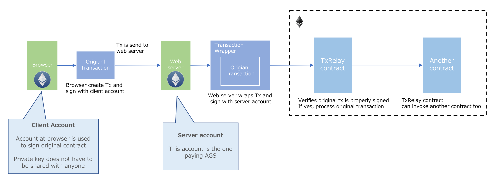

# The Zilliqa-Bouncer Project

## Goals:

* To implement a generic meta transaction (also known as [gasless transactions](https://medium.com/coinmonks/gasless-transactions-f75382095c4f)) bouncer-proxy inspired by [austingriffith](https://github.com/austintgriffith/bouncer-proxy) and [tsuzukits](https://github.com/tsuzukit/meta-transaction) ethereum implementations but using the [Zilliqa-native tooling](https://github.com/Zilliqa/Zilliqa-JavaScript-Library).
* Provide a generic Docker process for straightforward deployment.
* Integrate with a scilla-lang send by signature contract to be implemented in [references repo](https://github.com/starling-foundries/references).
* reference contracts for on-chain resolution of metatransaction functions including: forward, execution and whitelist.
* Example with a reference token.
* Scilla smart contract library for inclusion into complex smart-contracts
* Non-transferrable NFT example

### Diagram borrowed [from](https://github.com/tsuzukit/meta-transaction)

## Deployment

### Docker
TODO

###  NodeJS Development

1. Clone the repo:

    `git clone git@github.com:starling-foundries/zilliqa-bouncer.git`

2. Install deps:
   
    `cd zilliqa-bouncer && npm install`

3. Setup config.json (change networking, accounts here if needed):

    `cp config-base.json config.json`
   
4. To begin serving: 
   
    `npm run watch-ts` 
    
5. Open in browser to see results:
   
     `localhost:3000`

